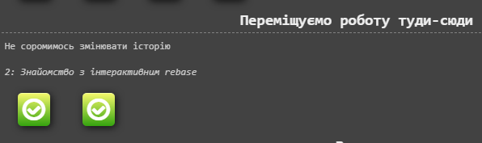

# kottans-frontend

### Дуже користні матеріали

## Linux CLI, and HTTP

  - Корисно вивчити консольні команди Linux.
  - Дуже цікава стаття про HTTP/HTTPS.

## Git Collaboration

  - Поглиблення знань про VCS, Git та GitHub.

## Intro to HTML and CSS

  - Поглиблення знань HTML та CSS.
  
## Responsive Web Design

  - - Поглиблення знань Responsive Web Design.
  - - Поглиблення знань Flex та Grid.
  